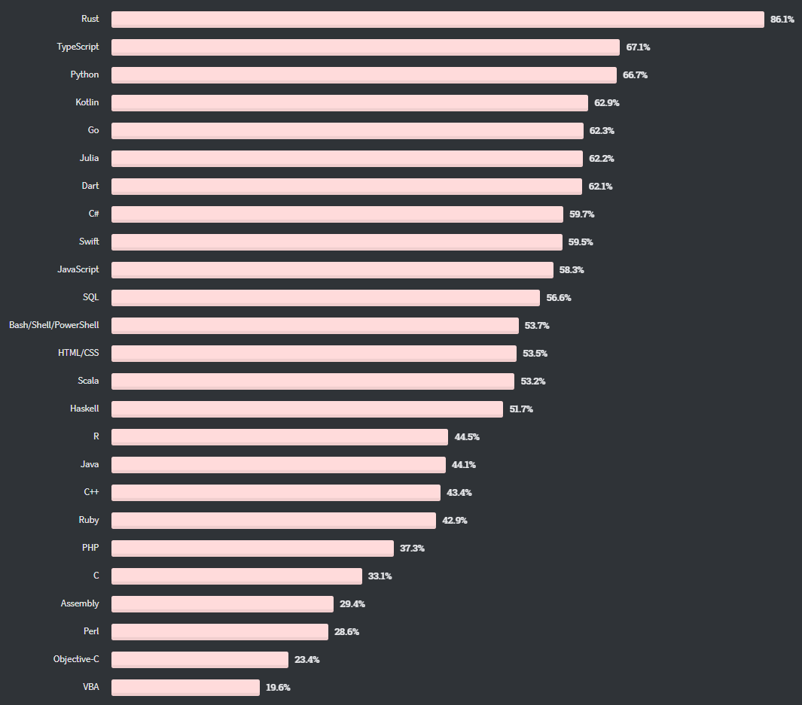

# DAY2_Homework

## 2020 개발자들에게 가장 사랑받는 언어 By Stack Overflow

 
 
 ##### [StackOverflow](https://insights.stackoverflow.com/survey/2020#most-loved-dreaded-and-wanted)
---

## Rust란?

>Mozilla가 Firefox web browser의 렌더링 엔진을 새로 작성하기 위해 개발한 언어로, 기존의 C/C++ 언어가 지니는 메모리 관리의 어려움을 언어 차원에서 해소하면서 최신의 멀티 코어 프로세스를 활용한 동시성에 대한 지원, 비용 없는 추상화 등 강력한 기능을 탑재한 시스템 프로그래밍 언어

- 러스트(Rust)는 C, C++, Go 언어와 같은 컴파일 기반의 언어이자 시스템 프로그래밍 언어에 속하며, Go와 비슷한 시기에 등장하면서 두 언어 모두 C, C++을 서로 다른 방향에서 대체하려 한다는 점 때문에 라이벌 관계로 엮이기도 한다.

- 멀티코어 프로세싱이 중요시되는 현 추세에 따라 동시성 프로그래밍 및 병렬 프로그래밍에도 강점을 가지고 있다.
 Rust는 현대적인 시스템 프로그래밍 언어로 C, C++와 동등한 수준의 속도를 달성하면서 메모리 오류를 완전히 없애는 것을 목표로 한다. 또한 함수형 프로그래밍 언어로부터 발전된 타입 시스템을 도입하였으며, 클래스 대신 트레이트(Trait)를 기반으로 다형성을 달성한다.

 -  매크로를 사용해 언어를 확장하는 것이 가능하며, 이 모든 것이 현대적인 모듈 시스템을 통해 쉽게 모듈화될 수 있다. 모듈들은 크레이트(Crate)라고 하는 단위로 묶여서 실행 파일이나 라이브러리로 배포될 수 있으며, Cargo라는 패키지 관리 프로그램을 통해 빌드 및 패키지 배포를 자동화하고 필요한 라이브러리를 Cargo를 통해 자동으로 다운로드받을 수 있다.

## Rust가 사랑받는 이유
> Rust는 C나 C++같은 저수준 프로그램 언어들이 번창했던 영역에서 이들 언어를 대체할 수 있기 때문있다. 지연에 민감한 네트워크 서비스용으로 가비지 컬렉션이 없는 러스트의 런타임 은 거의 없는 듯한 지연 시간을 낳는다. 또한 안정성 면에서 러스트의 입력시스템과 버로우체커(borrow Chercker)는 파이썬이나 자바, C++에서 정상으로 받아들여지는 모든 등급의 버그를 방지해준다.마지막으로 생산면에서는 최고의 빌드 시스템 및 패키지 관니자중 하나로, 탁월한 내장 문서화 툴도 제공한다.

## Rust의 장점
- 빠르다 
  - 러스트 코드는 여러 플랫폼에 걸쳐 기본 시스템 코드로 컴파일된다. 바이너리는 자체 포함되며 런타임이 없고, 생성된 코드는 C 또는 C++로 작성된 코드와 함께 기능한다.

- 안전하다 
  - 러스트는 안전하지 않은 메모리 사용을 시도하는 프로그램을 컴파일링 하지 않는다. 
  - 대부분의 메모리 오류는 프로그램이 실행중일 때 발견되는데 러스트의 구문과 언어 은유는 다른 언어에서 흔히 나타나는 메모리 관련 문제가 절대 생산까지 영향을 미치지 않도록 보장한다.
  - 컴파일러는 이러한 이슈에 플래그를 지정하고 프로그램ㅇ이 실행되기 전에 수정하도록 강제한다.

- 간접비용이 적게 발생한다
  - 러스트는 엄격한 규칙을 통해 메모리 관리를 통제한다. 

- 융통성이 있다. 
  - 러스트는 필요하다면 어느정도의 위험도 감수할 수 있도록 되어있다. 
    -  러스트의 안정장치는 C,C++ 의 'raw pointer'와 같이 메모리를 직접적으로 조작해야 하는 경우 부분적으로 비활성화 시키는 것이 가능하다.
    다만 러스트의 메모리 안전 오퍼레이션을 완전히 비활성화 시키는 것은 절대로 불가능하다. 
    - 안전 오퍼레이션을 부분적으로 비활성화 한다해도 안전의 기본 값이 훨씬 높은 소프트웨어가 탄생하게 된다.

- 크로스-플랫폼 언어이다
  -  러스트는 리눅스, 윈도우 및 맥OS의 세 가지 주요 플랫폼에서 모두 작동한다.

- 유용한 표준 라이브러리를 가지고 있다 

- IDE 지원이 훌륭하다
  - 러스트 컴파일러로부터 마이크로소프트 비주얼 스튜디오 코드와 같은 IDE에 실시간 피드백을 제공하는 러스트 랭기지 서버(Rust Language Server)를 도입했다. 러스트 랭기지 서버는 기본 구문 체킹 이상의 피드백을 제공한다.

## 단점
- 신생언어이기 때문에 자료가 많지 않으며 비교적 소규모 커뮤니티를 가지고 있다.
- 매우느린 빌드 속도로 인한 개발 생산성 하락
- 비슷한 수준의 동일한 CI서버에서 빌드했을 때 Go는 1분 미만, Kotlin은 약 3분이 걸린반면 Rust는 20분 가까이 소모되기도 함.
- 진입장벽이 높아 제대로 사용하기엔 시간과 비용이 많이 소모되는것
  - 문법이 엄격하고 기능이 다양해 초반에 배우기 어렵다

## 전망
> 러스트는 Stack Overflow에서 진행된 프로그래밍 언어 인기투표에서 수년 연속 1위를 차지할 정도로 높은 인기를 가진 언어이다. 하지만 투표에 참여한 응답자 중 97%는 실제 업무에서 Rust를 사용하지 않는 것으로 나타났다. 또한 Rust를 배우려는 개발자가 많지 않고 Rust로 진행되는 대형 프로젝트가 없어 앞으로의 전망도 밝지 않을 것이라는 반응이도 있다.

---

# 참조
https://zdnet.co.kr/view/?no=20200122110100
https://m.blog.naver.com/sundooedu/221706592707
https://lynlab.co.kr/blog/63
https://zdnet.co.kr/view/?no=20200506165142